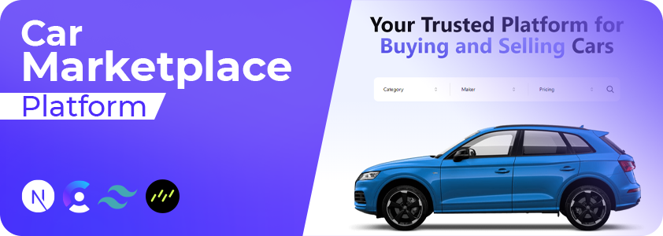

# Online Car Marketplace

A React JS application for an online marketplace that enables buying, renting, and selling cars. The platform features functionalities for tracking and analyzing car sales data, including detailed metrics on transactions, users, and vehicles across various locations. It utilizes advanced filtering and visualizations to enhance user experience and decision-making.




## Usage

Move to the client folder the use the [npm](https://www.npmjs.com/) to install necessary packages & dependencies.

```bash
npm install
```

Run the application using the following command:

```bash
npm run dev
```

After running the application, you can access the dashboard via the link provided in the console.

## Contact

[LinkedIn](https://www.linkedin.com/in/akhatarmourad/)
